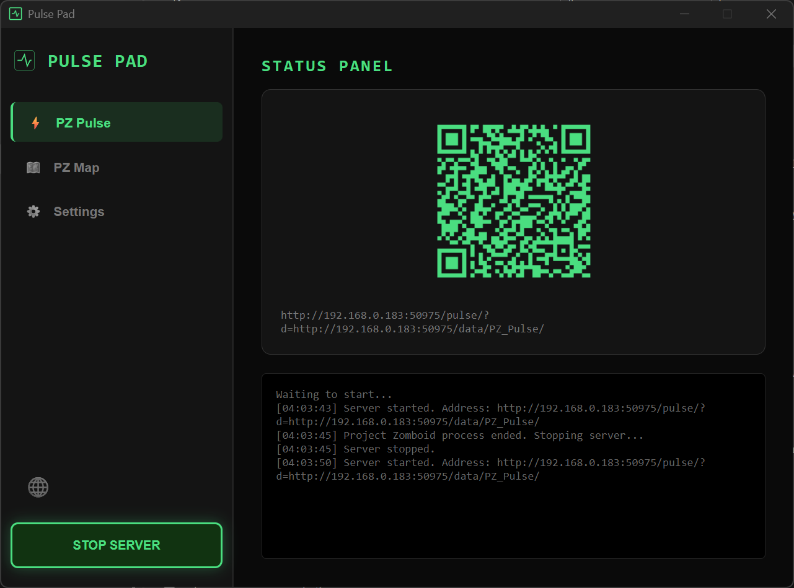
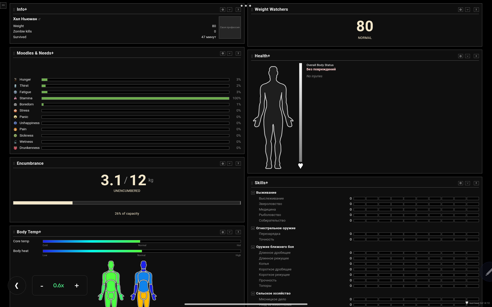

  <h1>🧟‍♂️ Pulse Pad</h1>
  
<b>Локальный сервер для переноса интерфейса Project Zomboid на твой смартфон.</b>

  
  

 

> 🌍 **CHOOSE YOUR LANGUAGE / ОБЕРІТЬ МОВУ / ВЫБЕРИТЕ ЯЗЫК:**
> *Expand the sections below / Розгорніть розділи нижче / Разверните нужный блок*

---

🇬🇧 <b>ENGLISH (Main)</b>

 

**Pulse Pad** is a lightweight background app that bridges Project Zomboid and your smartphone. It automatically hosts a local server, allowing you to view interactive maps and character statuses directly on your mobile device over Wi-Fi. 

No console commands. No IP configuration. Just scan and play.

### 👀 How it looks

  
  

### 🚀 Quick Start
1. Subscribe to the required mods in Steam Workshop:
   * [PZ Pulse (Status Panel)](https://steamcommunity.com/workshop/filedetails/?id=3753700423)
   * [PZ Map (Global Map)](https://steamcommunity.com/sharedfiles/filedetails/?id=3770149036)
2. Go to the [Releases page](../../releases/latest) and download the latest `Pulse.Pad_vX.X.X_setup.exe`.
3. Launch the app (it automatically finds the mod paths).
4. Click **Start Server** and scan the QR code with your phone.

### 📖 Setup Guide & Support
If you need a detailed step-by-step tutorial or run into issues, I've created a comprehensive guide specifically for regular players:
👉 **[Read the Official Steam Guide here](https://steamcommunity.com/sharedfiles/filedetails/?id=3797183917)**

*Don't forget to rate and favorite the guide on Steam if this tool saved your life in Knox County!*

### 🤝 Special Thanks
A massive shoutout to **[qwerto](https://steamcommunity.com/id/qwerto/myworkshopfiles/?appid=108600)**, the creator of the original PZ Pulse and PZ Map mods. This utility wouldn't exist without their incredible work. Go check out their workshop!

> **Note on Antivirus:** Windows Defender might flag the `.exe` (e.g., `Wacatac.C!ml`). This is a false positive common with indie apps that launch local servers and add themselves to startup. The code is 100% open-source here. Click *"More info" -> "Run anyway"*.

🇺🇦 <b>УКРАЇНСЬКА ВЕРСІЯ</b>

 

**Pulse Pad** — це легка програма, яка об'єднує Project Zomboid та твій смартфон. Вона автоматично створює локальний сервер, дозволяючи виводити інтерактивні мапи та статус персонажа прямо на екран мобільного через Wi-Fi.

Жодних консольних команд. Жодних налаштувань IP. Просто відскануй і грай.

### 👀 Як це виглядає

  
  

### 🚀 Швидкий старт
1. Підпишись на необхідні моди у Steam Workshop:
   * [PZ Pulse (Status Panel)](https://steamcommunity.com/workshop/filedetails/?id=3753700423)
   * [PZ Map (Global Map)](https://steamcommunity.com/sharedfiles/filedetails/?id=3770149036)
2. Зайди в розділ [Releases](../../releases/latest) та завантаж останній файл `Pulse.Pad_vX.X.X_setup.exe`.
3. Запусти програму (вона сама знайде шляхи до модів).
4. Натисни **Запустити сервер** та відскануй QR-код телефоном.

### 📖 Посібник та Підтримка
Якщо потрібна детальна інструкція крок за кроком або щось пішло не так, я написав максимально зрозумілий гайд для звичайних гравців:
👉 **[Читати офіційний посібник у Steam](https://steamcommunity.com/sharedfiles/filedetails/?id=3797183917)**

*Не забудь поставити лайк та додати в обране у Steam, якщо ця прога допомогла тобі вижити в окрузі Нокс!*

### 🤝 Подяка
Величезна подяка автору **[qwerto](https://steamcommunity.com/id/qwerto/myworkshopfiles/?appid=108600)** за створення оригінальних модів PZ Pulse та PZ Map. Без його неймовірної роботи цієї утиліти просто не існувало б. Обов'язково загляньте в його майстерню!

> **Про Антивірус:** Windows Defender може лаятися на `.exe` файл (наприклад, `Wacatac.C!ml`). Це типове хибне спрацювання для інді-програм, які піднімають сервери та лізуть в автозавантаження. Код повністю відкритий. Просто натисни *"Детальніше" -> "Виконати в будь-якому випадку"*.

🇷🇺 <b>РУССКАЯ ВЕРСИЯ</b>

 

**Pulse Pad** — это легкая софтина, которая связывает Project Zomboid и твой смартфон. Она автоматически поднимает локальный сервер, позволяя выводить интерактивные карты и статус персонажа прямо на экран мобилы по Wi-Fi.

Никакой возни с консолью. Никакой настройки IP-адресов. Просто сканируй и играй.

### 👀 Как это выглядит

  
  

### 🚀 Быстрый старт
1. Подпишись на нужные моды в Steam Workshop:
   * [PZ Pulse (Status Panel)](https://steamcommunity.com/workshop/filedetails/?id=3753700423)
   * [PZ Map (Global Map)](https://steamcommunity.com/sharedfiles/filedetails/?id=3770149036)
2. Зайди в раздел [Releases](../../releases/latest) и скачай последний `Pulse.Pad_vX.X.X_setup.exe`.
3. Запусти программу (она сама найдет пути к модам).
4. Нажми **Запустить сервер** и отсканируй QR-код телефоном.

### 📖 Руководство и Поддержка
Если нужен подробный разбор настройки для чайников или что-то не работает, я написал максимально понятный гайд для работяг:
👉 **[Читать официальное руководство в Steam](https://steamcommunity.com/sharedfiles/filedetails/?id=3797183917)**

*Не забудь влепить лайк и добавить в избранное в Steam, если эта прога спасла твою жопу в округе Нокс!*

### 🤝 Благодарности
Огромный респект автору **[qwerto](https://steamcommunity.com/id/qwerto/myworkshopfiles/?appid=108600)**, создателю оригинальных модов PZ Pulse и PZ Map. Без его охуенной работы этой утилиты бы просто не было. Обязательно зацените его мастерскую!

> **Про Антивирус:** Защитник Windows может ругаться на `.exe` (выдавать `Wacatac.C!ml`). Это классическое ложное срабатывание на инди-софт, который создает сервер и прописывается в автозагрузку. Весь код открыт. Просто нажми *"Подробнее" -> "Выполнить в любом случае"*.

 

  <i>Created with 🧠 by <a href="https://github.com/Vlaseeds">Vlaseeds</a></i>

